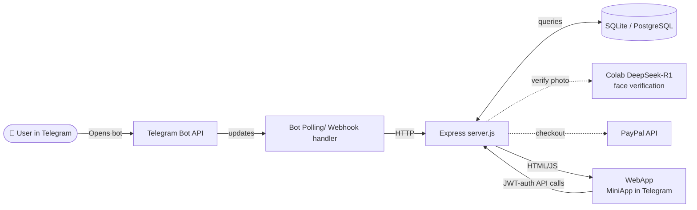
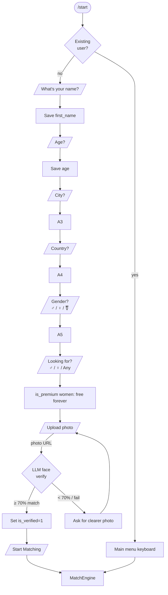
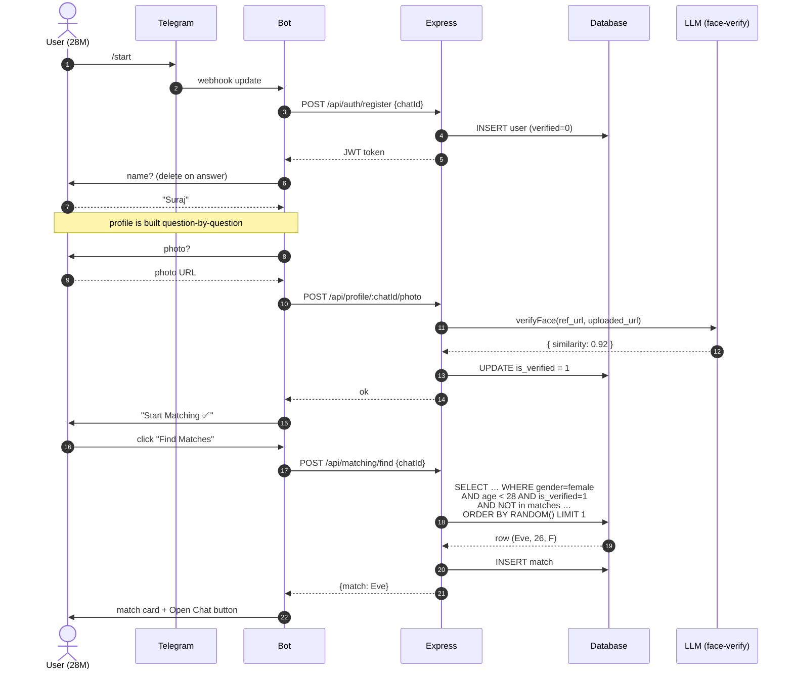
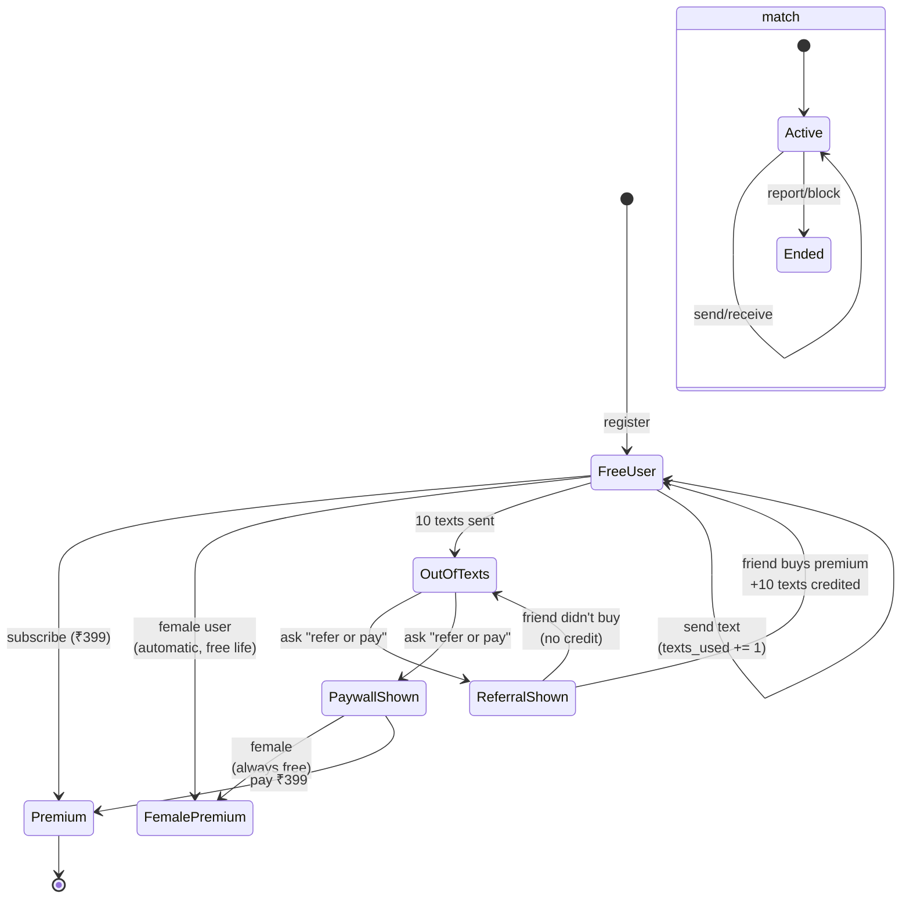
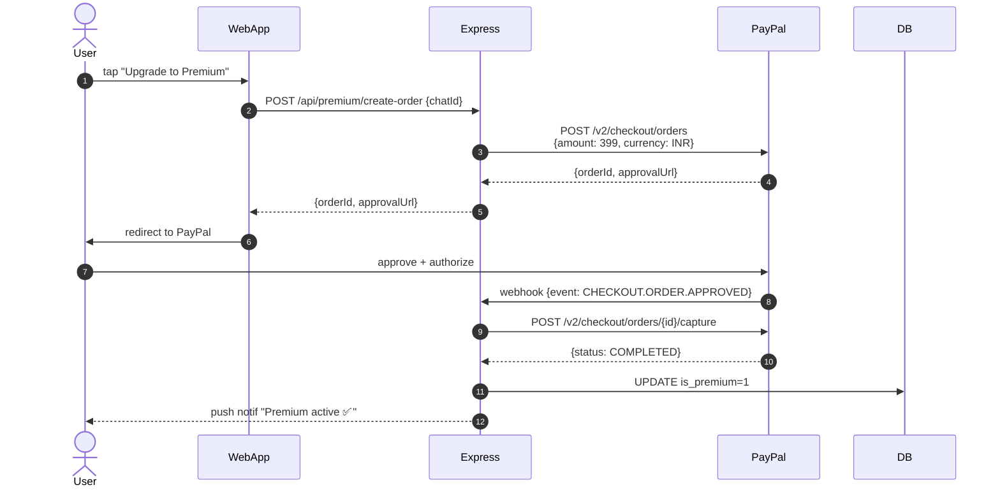
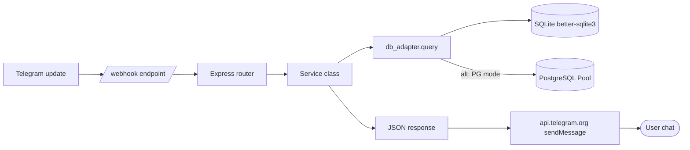
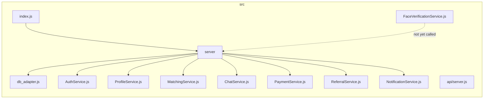

# Telegram Dating Bot — Process Flow

Last updated: 2026-06-17
Stack: Node.js + Express + SQLite/PostgreSQL + Telegram Bot API + WebApp Mini App
Status: Backend live (`http://localhost:3000`), stubbed face-verification, stubbed PayPal

---

## 1. System Architecture (high-level)



---

## 2. Onboarding Flow (the 18-step spec)



Question texts auto-disappear after answer (`deleteMessage` on each transition).

---

## 3. Matching Sequence



---

## 4. Chat & Paywall State Machine



---

## 5. Premium Subscribe (PayPal) Sequence



> **Note**: PayPal integration is currently **stubbed** — `/api/premium/subscribe` auto-activates premium in dev. Real flow above requires `PAYPAL_CLIENT_ID` + `PAYPAL_CLIENT_SECRET` and webhook route mounted.

---

## 6. Referral Lifecycle

```mermaid
flowchart LR
    A[Alice generates<br/>t.me/bot?start=ref_REF_A]
    A --> B[Bob joins via link]
    B --> C[Bot stores referred_by=Alice]
    C --> D{Bob buys premium?}
    D -- yes --> E[Alice +10 texts credited<br/>notify Alice]
    D -- no  --> F[No credit<br/>(link expires)]
```

---

## 7. End-to-end request route (data path)



---

## 8. File-to-feature map


